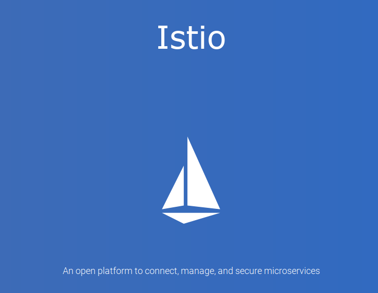
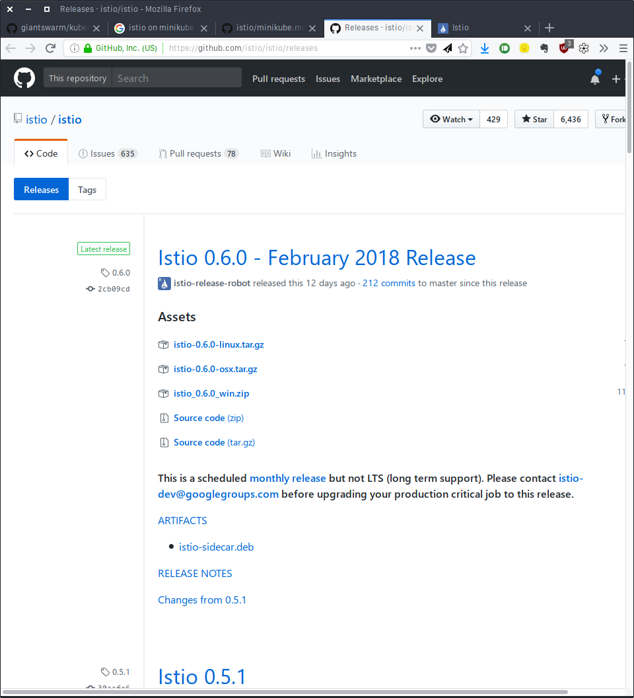
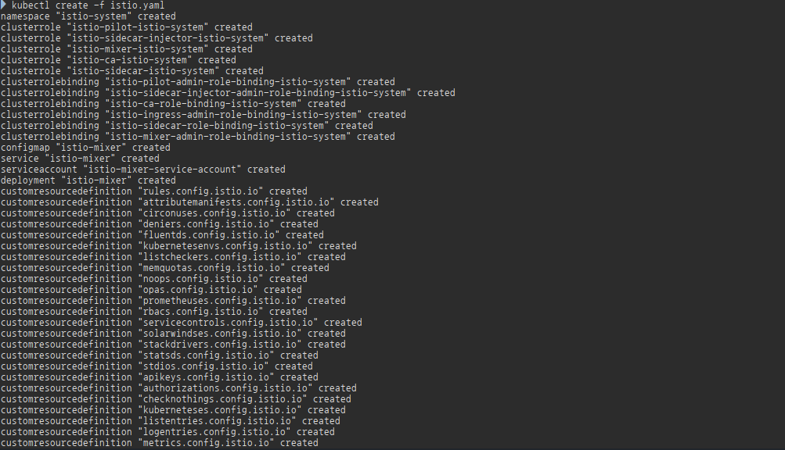

## Istio (An open platform to connect,manage,and secure microservices)


### Installation
http://github.com/istio/istio/releases 에서 환경에 맞는 istio를 다운로드 한다.


압축을 풀고, bin/istioctl은 환경설정 PATH에 추가한다

### Minikube 준비
istio를 사용하기 위해서는, CRD, RBAC과 Initializers를 Enable시켜야 한다

- CRD (custom resource definition) : K8s 1.7+
- RBAC (roles, bindins) : K8s 1.8+ / minikube에서는 기본으로 enable되어 있지 않기 때문에 enable시켜줘야 한다

Istio sidecar auto injection : Initializer concept in K8s를 사용한다. Initializer는 Alpha feature이다. Alpha feature


CRDs require Kubernetes 1.7+
As reported by kubectl version, your minikube started single-node Kubernetes cluster is 1.6.4.
Recreate existing cluster via minikube (`minikube delete` followed by `minikube start ...`)

Istio uses RBAC (roles, bindings). Even though RBAC is GA/stable as of Kubernetes 1.8, it is a feature which is not enabled by default. When starting minikube managed single-node Kubernetes cluster make sure to enable RBAC for your cluster.
If you want to use Istio sidecar auto injection feature it relies on Initializers concept in Kubernetes. Initializers are an alpha feature. Alpha features are not enabled by default, one has to explicitly enable them too.

Here's an example command you can use to start single-node Kubernetes cluster locally on Mac with VirtualBox VM and given resources using minikube with RBAC and Initializers features enabled


```bash
minikube start \
  --feature-gates=CustomResourceValidation=true \
  --extra-config=apiserver.authorization-mode=RBAC \
  --extra-config=apiserver.Admission.PluginNames="Initializers,NamespaceLifecycle,LimitRanger,ServiceAccount,DefaultStorageClass,GenericAdmissionWebhook,ResourceQuota"
```

### Istio 설정
download받은 istio폴더의 install/kubernetes/istio.yaml을 
```bash
kubectl apply -f install/kubernetes/istio.yaml
```


