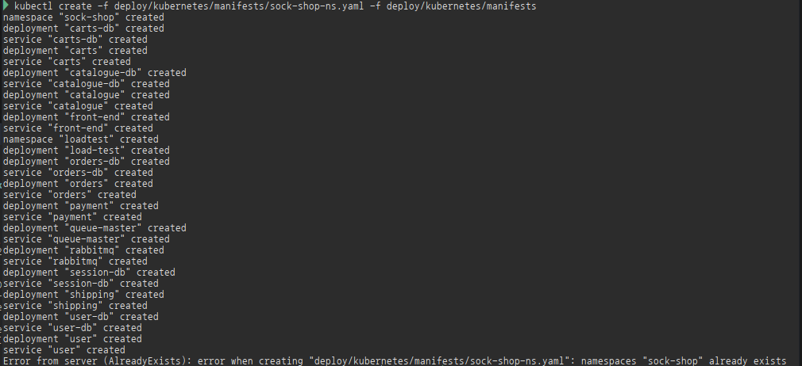
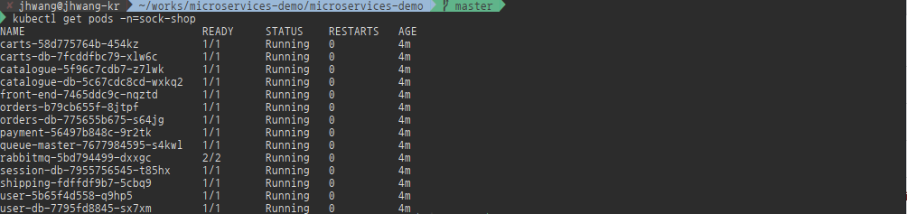
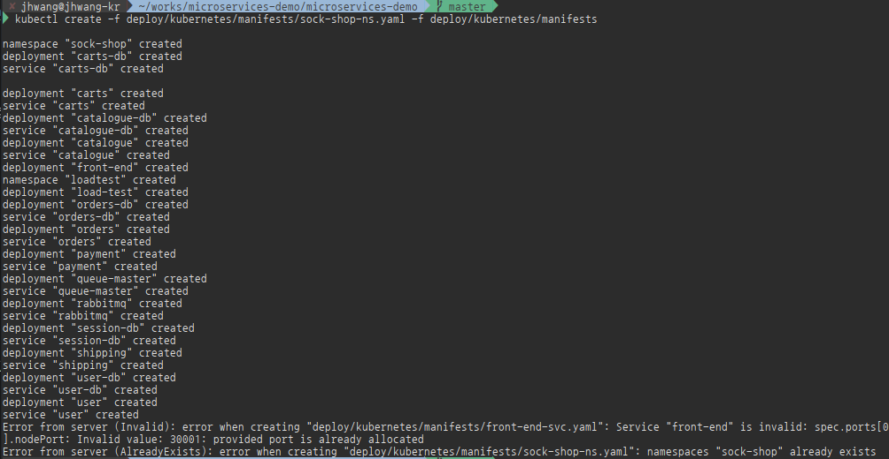
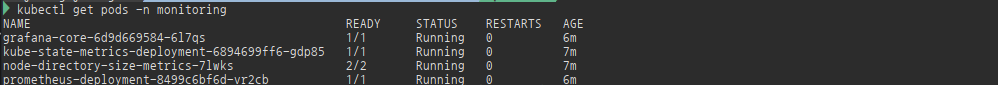
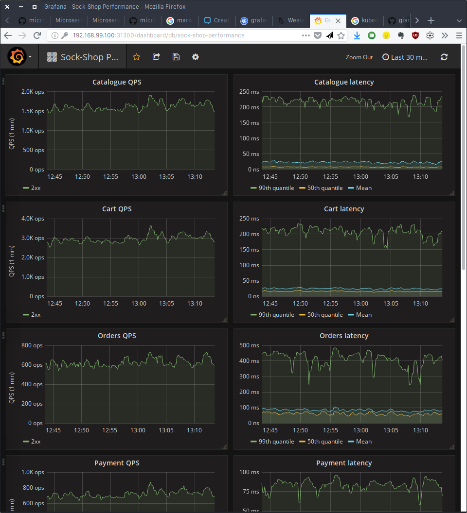
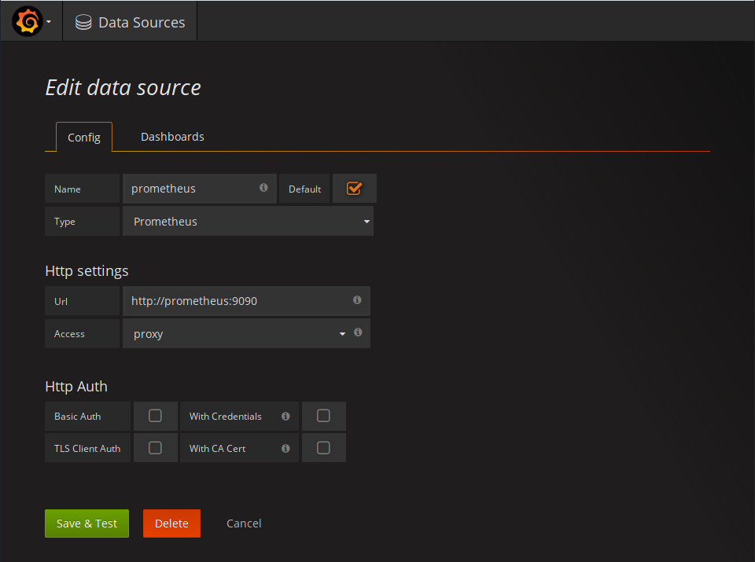
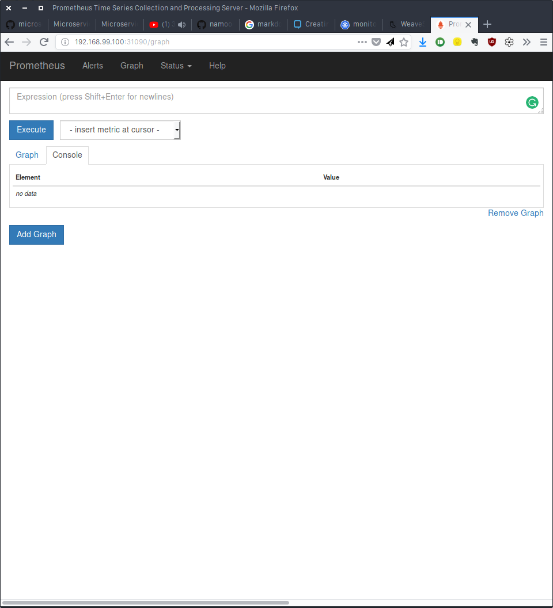

## Sock Shop : A Microservice Demo Application

이 응용 프로그램은 양말을 판매하는 온라인 상점의 사용자 인터페이스 부분입니다. Microservice 와 Cloud Native 기술 데모 및 테스트를 돕기위한 것으로, WeaveWorks에서 Open Source로 배포한 것이다.
출처 : http://github.com/microservices-demo/microservices-demo

>기술 셋 : **Spring Boot, Go Kit, Node.js on Docker** (dotnet, microprofile)
--> Microprofile, dotnet core, Python 등 사용가능

앞으로 이 기본 Demo Application을 가지고 Microservices를 구성할 때 고민해야 하는 다양한 패턴을 적용해 보자.

### Screenshot


### Design
#### 목표
- Demonstrate microservice best practices (and mistakes!)
- Be cross-platform: deploy to all orchestrators
- Show the benefits of continuous integration/deployment
- Demonstrate how dev-ops and microservices compliment each other
- Provide a "real-life" testable application for various orchestration platforms

#### Architecture


microserivces 응용 프로그램의 아키텍처는 가능한 한 많은 마이크로 서비스를 제공하기 위해 의도적으로 설계되었다. 자신만의 디자인을 고려하고 있다면 반복적인 접근 방식을 권장합니다.이 방식을 사용하면 응용 프로그램에서 문제(성능 / 테스트 / 커플링)가 발생할 때 새로운 마이크로서비스 만 정의 하면 된다.
또한, 여러 가지 기술을 연습하는 것은 의도적으로 Polyglot으로 구성되었습니다. 필요에 따라 신기술만 고려하면 된다.

위 이미지에서 알 수 있듯이 마이크로 서비스는 전자 상거래 사이트의 간단한 기능을 정의한 것이다. 모든 서비스는  개발 및 테스트의 단순성을 위해 REST를 사용하여 통신한다. API는 개발 중이다.
[출처:weaveworks microservices-demo]


### Deploy
sock shop - microservices application은 다양한 Docker환경에 Deploy할 수 있도록 deployment설정을 제공한다.
- aws-ecs
- docker-compose
- docker-swarm
- kubernetes
- mesos-marathorn
- nomad

여기에서는 이전 meetup에서 몇번 사용한 minikube를 사용한다
>사전 필요 사항
>  - git
>  - docker
>  - minikube
>  - kubectl

#### Clone the microservices-demo repo
```bash
git clone https://github.com/microservices-demo/microservices-demo
cd microservices-demo
```
#### Start minikube with 4GB Memory (if you can, 8GB is better)
```bash
minikube start --memory 6144
```

>만약 Fluentd + ELK based logging을 사용할 경우, 최소 6GB의 메모리와 VM의 Guest >OS의 "vm.max_map_count=262144 or higher"로 설정하고, manafests를 시작시킨다
>```bash
>minikube delete
>minikube config set memory 6144
>minikube start
>minikube ssh
>```
>VM에 접속후
>```bash
>sudo sysctl -w vm.max_map_count=262144
>```
>logging manifests를 실행시킨다
>```bash
>kubectl create -f deploy/kubernetes/manifests-logging
>```
>Kibana dashboard는 http://192.168.99.100:31601 로 들어가서 볼 수 있다


#### Start Sock-shop webpage
sock-shop application을 minikube에 배포한다
```bash
kubectl create -f deploy/kubernetes/manifest/sock-shop-ns.yml -f deply/kubernets/manifests
```


모든 pod이 Running이 되도록 기다린다.
```bash
kubectl get pods -n=sock-shop
```


>**주의**
>manifests실행시 front-end svc에서 "nodePort: Invalid value: 30001: provided port is already allocated" 에러는 minikube ingress backend service가 이미 30001을 사용해서 발생한다.
>
>이 경우 minikube의 ingress services를 삭제 후 다시 실행한다.
>```bash
>minikube config set ingress false
>```

#### Sock-shop webpage
http://192.168.99.100:30001

<!-- #### Opentracing
Opentracing을 실행시키기 위해서
```bash
kubectl create -f deploy/kubernetes/manifests-zipkin/zipkin-ns.yaml -f deploy/kubernetes/manifests-zipkin
``` -->

#### Monitoring with Prometheus
모든 모니터링은 prometheus로 한다, 모든 서비스는 /metrics라는 endpoint를 제공하며, *request_duration_seconds* 라는 prometheus histogram을 가지고 있다. 이 값은 _count, _sum, _bucket metrics를 생성하기 위해서 자동으로 추가된다.
```bash
kubectl create -f deploy/kubernetes/manifests-monitoring/monitoring-ns.yaml -f deploy/kubernetes/manifests-monitoring
```
모든 pod이 Running이 될때 까지 잠시 기다리자


>github의 grafana는 svc를 LoadBalancer를 통해서 제공하도록 되어 있는데, 여기서는 NodePort로 변경하자

변경 전
```yml
apiVersion: v1
kind: Service
metadata:
  name: grafana
  namespace: monitoring
  labels:
    app: grafana
    component: core
spec:
  type: LoadBalancer
  ports:
  - protocol: TCP
    port: 80
    targetPort: 3000
  selector:
    app: grafana
    component: core
```
변경 후
```yml
apiVersion: v1
kind: Service
metadata:
  name: grafana
  namespace: monitoring
  labels:
    app: grafana
    component: core
spec:
  type: NodePort
  ports:
  - protocol: TCP
    port: 3000
    targetPort: 3000
    nodePort: 31300
  selector:
    app: grafana
    component: core
```

Loadbalancer를 nodePort로 변경한다
```bash
kubectl apply -f deploy/kubernetes/manifests-monitoring/grafana-svc.yaml
```

##### Open Grafana Dashbaord and prometheus
Grafana는 31300, Prometheus는 31090 Nodeport로 제공된다 

grafana Dashboard : http://192.168.99.100:31300

login은 admin/admin

>Prometheus Datasource가 추지 않은 경우, Datasource를 추가해 준다



prometheus : http://192.168.99.1000:31090



>alert를 위해서는 "minitoring-alert" manifest를 이용하면 된다. 여기에서는 Pass.. 다음 기회에..
